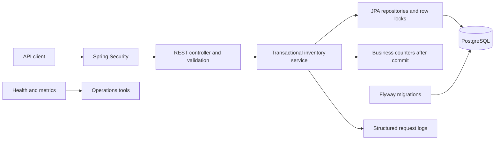

# Architecture and decisions

## Stock consistency

Reservation creation locks one product row with `SELECT ... FOR UPDATE`, checks stock, subtracts the requested quantity, and inserts the reservation in one transaction. Competing requests for that product wait for the lock, then read the committed stock. A rejected request rolls back without creating a reservation or consuming stock.

Cancellation locks the owned reservation before inspecting its status, then locks its product and restores stock. Subsequent cancellations observe `CANCELLED` and return the same record. Different products remain independently writable. The service uses PostgreSQL's ordinary transaction isolation plus explicit row locks.

PostgreSQL additionally enforces normalized unique SKUs, foreign keys, stock and quantity bounds, valid statuses, and consistent cancellation timestamps. Java timestamps are truncated to PostgreSQL's microsecond precision so the initial response and later idempotent reads agree.

## API and persistence boundaries

Controllers map entities to response records. Database sessions close at service transaction boundaries (`open-in-view=false`); reservation queries fetch the product relationship needed by response mapping. Pagination sorts by creation time descending and ID ascending, with matching indexes. The reservation owner always comes from the authenticated principal, never a customer-supplied body field. Requests for another customer's reservation return 404.

## Authentication

Explicit local/test profiles provide in-memory accounts with BCrypt hashes generated from externally supplied passwords. Production is the default and uses Spring Security's OAuth2 resource server. Signed JWTs must satisfy issuer, audience, and expiry checks. The `roles` claim maps to application roles; `sub` identifies the owner. Production integration tests exercise the real decoder against a temporary public-key endpoint.

JSON content types are required for all mutations, including bodyless cancellation, to prevent browser form submissions from using cached local Basic credentials. No CORS policy permits other origins. Responses provide CSP and standard security headers. Health details are visible only to administrators, while the public health status supports container probes.

## Deployment boundary

Local Compose runs the application and PostgreSQL with persistent storage. The proposed AWS environment runs the same application image on ECS Fargate, with an HTTPS ALB and isolated RDS PostgreSQL. Terraform owns infrastructure; the manual release workflow owns service image revisions after provisioning. The production database connection verifies the AWS RDS certificate and hostname.

Database preparation runs as a separate one-shot job with owner credentials. The web service uses `inventory_app`, which can only select, insert, and update business tables. Separate ECS execution roles prevent the web task from retrieving the owner secret. Each deployment runs migrations before starting the selected image; intentional image rollback preserves the current schema and grants. Runtime-password rotation requires the maintenance procedure in the operations guide. Deployment files have not been applied to AWS; local recovery and load reports do not establish cloud recovery or capacity.

Each image contains a versioned compatibility contract. Release tooling inspects the immutable candidate and live rollback baseline before migration or deployment. The contract declares supported behavior; tests and security scanning remain separate requirements. A local rollback drill verifies the previous application on one additive schema change while retaining data and retry keys.

## Operational measurements

Eight fixed business counters record successful commits, reservation replays, first cancellations, repeated cancellations, and stock movement. Transaction completion callbacks prevent failed or rolled-back work from increasing successful business metrics. Replays never add stock movement, and no customer/product/request identifiers become metric labels. Counters reset on restart and can miss events around process failure; PostgreSQL remains the authoritative inventory record.

The protected metrics endpoint stays available during a database outage while the separate readiness endpoint reports failure. The local monitoring drill verifies this distinction with actual Prometheus scraping, a readiness probe, and matching firing/resolved Alertmanager notifications to a private receiver. Production monitoring uses the cloud configuration and requires its own alert-routing verification. See [business metrics](business-metrics.md) and [monitoring](monitoring.md).
