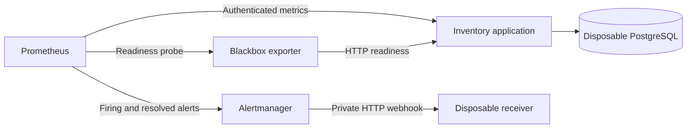

# Local monitoring and notification delivery

The monitoring drill runs real Prometheus, Alertmanager, and blackbox exporter containers against an isolated application and PostgreSQL database. It proves that protected metrics are scraped, a database outage raises a readiness alert while the application remains alive, and both firing and resolved notifications reach a private disposable webhook receiver.

No Slack, email, cloud notification service, or external webhook is used. The existing Compose application, database, and credentials are untouched.

## Run the drill

Requirements: Python 3, Docker, a locally built application image containing the business metrics, and the pinned monitoring images. The current image references are recorded in [monitoring/images.json](../monitoring/images.json). Pull those exact references once:

```sh
python3 - <<'PY'
import json
import subprocess
from pathlib import Path
for component in json.loads(Path('monitoring/images.json').read_text()).values():
    subprocess.run(['docker', 'pull', component['image']], check=True)
PY
python3 scripts/monitoring-drill.py \
  --image inventory-cloud-service-app \
  --report reports/monitoring/latest.json
```

The drill itself does not pull images. It resolves all locally available images to exact IDs and records the application, PostgreSQL, Prometheus, Alertmanager, blackbox exporter, and receiver images in the report. Set `--image sha256:...` to use a specific application image. The same command accepts a report path such as `target/operations/monitoring.json` in CI.

Run it after other resource-intensive Docker work. The active application is limited to 768 MiB and PostgreSQL to 384 MiB. Prometheus, Alertmanager, blackbox exporter, and the receiver are capped at 256, 128, 64, and 64 MiB respectively, with half a CPU each. Observation waits share a four-minute deadline; startup and cleanup also have bounded waits. A healthy run normally finishes within a few minutes.

## Signals and alert path



The application metrics job scrapes `/actuator/prometheus` every two seconds with a generated local administrator password. Prometheus supports reading Basic authentication passwords from a file; the drill mounts a temporary mode-0600 password file only into the Prometheus container. Anonymous metrics requests must return 401 and customer requests 403. [Prometheus HTTP configuration](https://prometheus.io/docs/prometheus/latest/configuration/configuration/)

Readiness is a separate blackbox HTTP job, sampled every ten seconds with an eight-second probe timeout. Only HTTP 200 is accepted. The application's database socket timeout is five seconds, allowing an unavailable database to produce an actual readiness 503 inside the probe window. The blackbox exporter supports explicit accepted status codes and HTTP redirect control. [Blackbox HTTP probe configuration](https://github.com/prometheus/blackbox_exporter/blob/master/CONFIGURATION.md)

The `InventoryReadinessFailed` rule fires when `probe_success{job="inventory-readiness"}` remains zero for four seconds. Prometheus evaluates the rule every second. Alertmanager groups notifications with a one-second initial wait and a two-second update interval, and `send_resolved` is enabled. These short intervals are for a repeatable local drill. Production alert thresholds and routing need separate operational decisions. [Alerting rules](https://prometheus.io/docs/prometheus/latest/configuration/alerting_rules/), [Alertmanager routing and webhook configuration](https://prometheus.io/docs/alerting/latest/configuration/)

## What a passing run proves

1. The real one-shot migration job exits successfully, and the application starts with the restricted `inventory_app` login and startup Flyway disabled.
2. Authenticated scraping succeeds and JVM memory series reach Prometheus. The public and customer metrics-access checks fail with the expected authorization statuses.
3. A product is created, three units are reserved, the same reservation key is replayed, and the reservation is cancelled. The scraped counters `inventory_reservations_total`, `inventory_reservations_replayed_total`, and `inventory_reservations_cancelled_total` each equal one. The exported reservation-creation name is `inventory_reservations_total`; the exporter removes the reserved `_created` suffix from the original counter name.
4. Only the fixture's PostgreSQL container is paused. Blackbox reports `probe_success=0` and HTTP 503, while the authenticated application scrape remains `up=1` with a fresh sample and application liveness remains HTTP 200.
5. Prometheus reports the readiness alert as firing, and the private receiver records the actual Alertmanager firing notification. The script does not inject synthetic alerts or notification payloads into the running drill.
6. PostgreSQL is unpaused. Readiness returns to HTTP 200, the alert disappears from Prometheus, and the receiver records a resolved notification with the same alert fingerprint. A final authenticated product read verifies all nine units remain available.

The JSON evidence includes sanitized notification receipts, status transitions, exact image IDs, metric observations, time to firing/resolved delivery, configuration without the password value, and cleanup results. The private receiver keeps only a fixed set of alert fields, validates the run identifier and timestamps, and rejects unrelated alerts. It never sends requests elsewhere or logs raw incoming payloads.

## Configuration and failure handling

The checked-in templates under `monitoring/` use JSON syntax, which the monitoring tools accept as YAML configuration. Per-run files substitute only owned container names and a generated run identifier. Private files live in a temporary directory under the ignored `.local/` folder and are deleted after container cleanup.

The script rejects external webhook destinations, additional message receivers, remote-write configuration, unknown scrape-job fields, altered readiness relabeling, and notification or protected-metrics redirects. Only the fixed fixture targets and private receiver are accepted. Prometheus and the receiver expose random loopback ports for local inspection; Alertmanager, blackbox exporter, and PostgreSQL have no published ports.

The shared recovery fixture tracks every container and network by exact name and ownership labels. Cleanup refuses resources outside that ownership. An exception during the outage unpauses the owned database before teardown. Missing metrics, stale scrapes, an unrelated notification, failure to resolve, or incomplete cleanup causes a nonzero exit and a failed report. Normal completion removes the temporary containers, network, metrics storage, receiver memory, and credentials.

Offline safeguards can be checked without Docker:

```sh
python3 -m unittest discover -s scripts -p test_monitoring.py -v
```

## Image sources and limits

The [final recorded run](../reports/monitoring/final.json) passed on September 14, 2026 UTC against application image `sha256:c8a1bef9d5d0402c3b1546b7de27f7a305c214ab67517b20d1c187599ca7de2d`. All three business counters equalled one, eight JVM memory series were scraped, and metrics remained available during the readiness failure. The actual firing notification was observed 17.016 seconds after pausing PostgreSQL; the matching resolved notification was observed 2.060 seconds after unpausing. Cleanup completed without errors. [Result summary](../reports/monitoring/README.md)

The pinned image set uses Prometheus 3.14.0, Alertmanager 0.34.0, blackbox exporter 0.28.0, and the official Python 3.13 Alpine image for the small receiver. Versioned Prometheus components were verified against the project's official download page, then their registry digests were recorded. [Prometheus downloads](https://prometheus.io/download/), [official Python image](https://hub.docker.com/_/python)

This is evidence of local collection, rule evaluation, and private webhook delivery. It does not establish production alert latency, external notification delivery, durable monitoring retention, high availability, production JWT scraper credentials, or AWS monitoring behavior. The generated Basic credentials and accelerated thresholds are specific to the disposable local profile.
